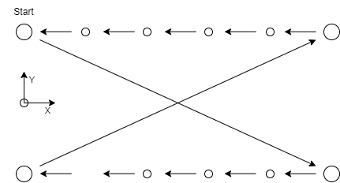
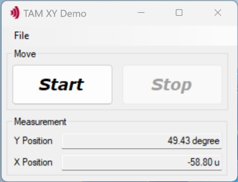

# TAM XY Demo

Move a stage in X and Y direction according to the graph below.

## Hardware Prerequisites

- Two *Triamec* drives with a motor and encoder connected and configured with a stable position controller
- Connection to the drives by *Tria-Link* via Tria-Link PCI adapter (TL100 or TLC201)

## Software Prerequisites

This project is made and built with [Microsoft Visual Studio](https://visualstudio.microsoft.com/en/).

In addition you need [TAM Software](https://www.triamec.com/en/tam-software-support.html) installation.

## Prepare Application

1. Open file `Properties > Settings.settings` (if used in a IDE) or `XY Demo.exe.config` (if used as an executable) and configure the parameters to your needs.
- `xNumberOfSteps` number of steps in X direction according to the graph above
- `sleepTime` time (in milliseconds) in stillstand after move  before the next move is executed
- `yAxisName` name of the axis that behaves as the Y axis according to the graph above
- `xAxisName` name of the axis that behaves as the X axis according to the graph above

2. Replace the `XYDemo.TAMcfg` configuration file with one matching your setup. To generate such a file, use the TAM System Explorer Software and go to `File > Save TAM Configuration...`. The TAM System Explorer can also help you find the `x/yAxisName` for the settings.

3. Build/start the `XY Demo.sln` (if used in an IDE) or the `XY Demo.exe` (if used as an executable)

## Operate Application

Simply use the Start and Stop buttons. The Start of the sequence might takes some seconds, as the axes are enabled and start commutation according to your configuration.

